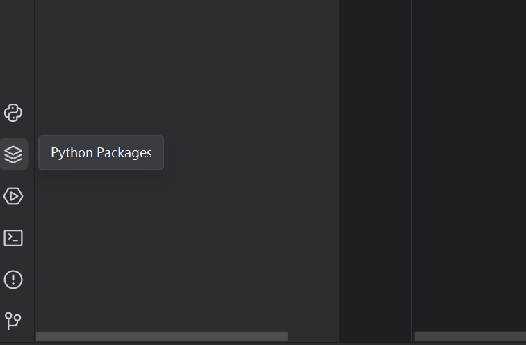
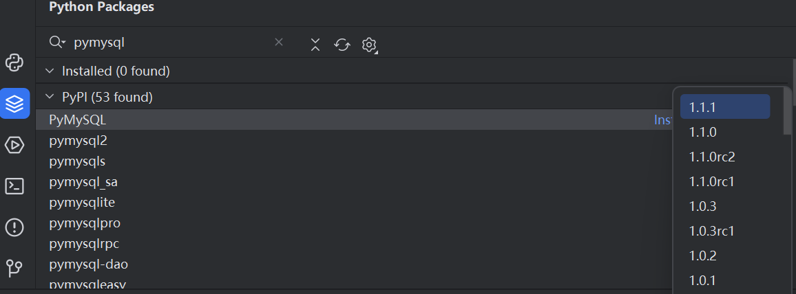
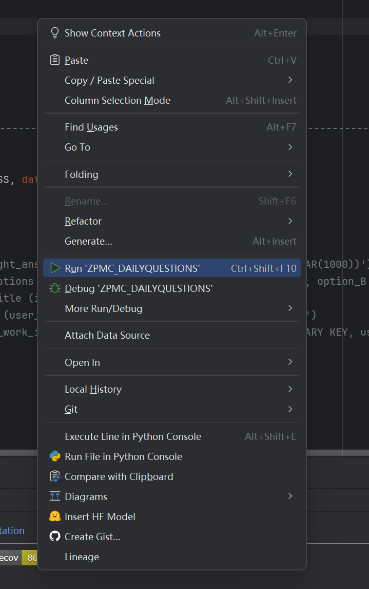

Created by python etc

# 每日答题半自动程序

### 运行前需要提前准备的事

1. 安装pycharm

- pycharm windows版本下载地址：https://www.jetbrains.com/pycharm/download/#section=windows
- 参考文档：https://blog.csdn.net/qq_44809707/article/details/122501118?ops_request_misc=%257B%2522request%255Fid%2522%253A%25220e9649a982f4191f132c0491dcd51228%2522%252C%2522scm%2522%253A%252220140713.130102334..%2522%257D&request_id=0e9649a982f4191f132c0491dcd51228&biz_id=0&utm_medium=distribute.pc_search_result.none-task-blog-2~all~top_positive~default-2-122501118-null-null.142^v101^pc_search_result_base8&utm_term=pycharm%E5%AE%89%E8%A3%85%E6%95%99%E7%A8%8B&spm=1018.2226.3001.4187
---

2. 从code下载解压版文件到本地并解压
3. 通过pycharm打开项目文件并通过pycharm安装所需要的第三方库
- pymysql
- selenium
- bs4
- pyzbar
- Pillow

点击python packages图标

输入需要安装的包名并安装最新版

4. 右键运行即可

